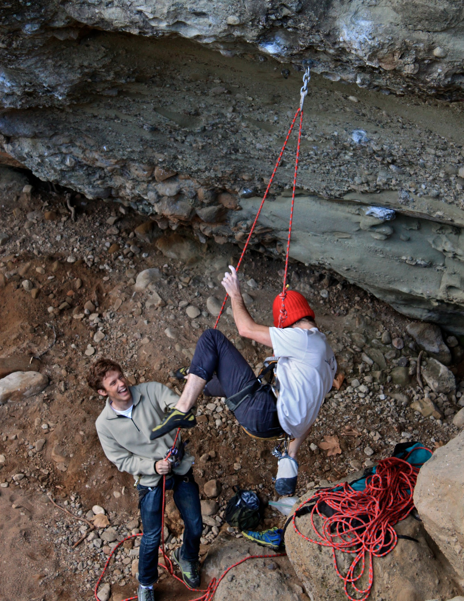
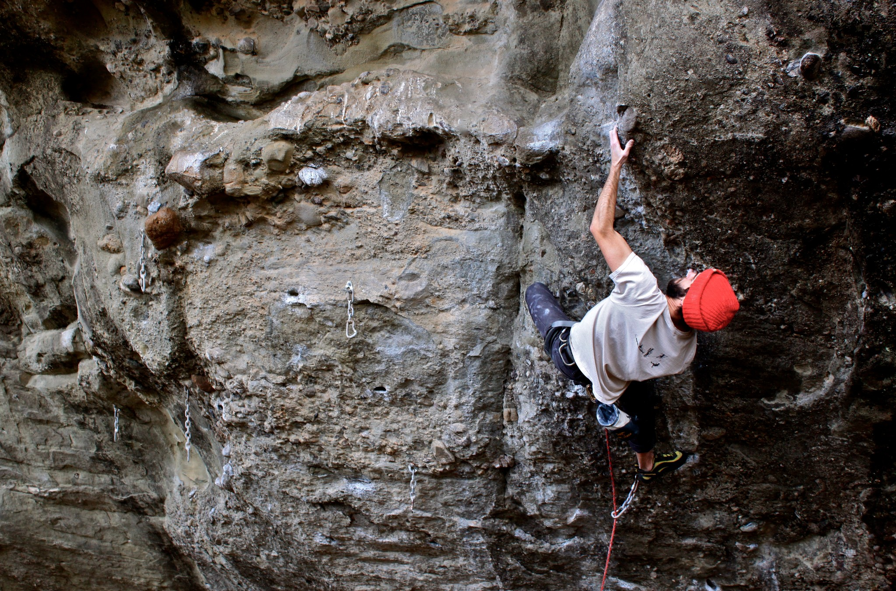

Owl Tor is hidden in the hills east of Santa Maria. It has about a dozen routes on conglomerate rock and manufactured pockets, all of which are steep and burly. Jason had just bought a new rope and Cody and I were eager to help him break it in. We started off on a short but powerful route called Auto Magic (5.12a).

The “warm-up ” at the crag is a sandbagged 70-foot 5.11d called The Power of Eating. Every move is made at full extension to some of the biggest holds you will ever fall off of.

\- Itai
