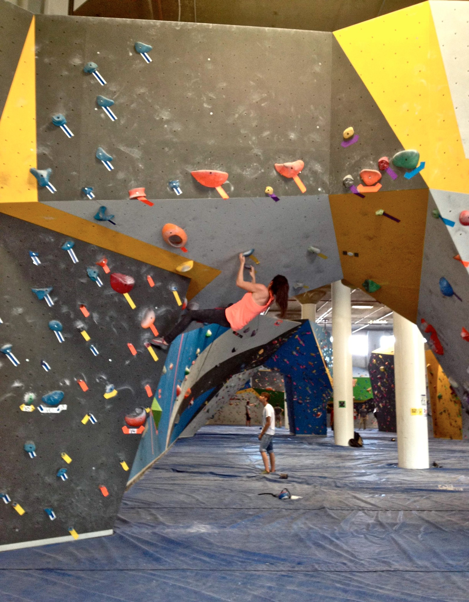
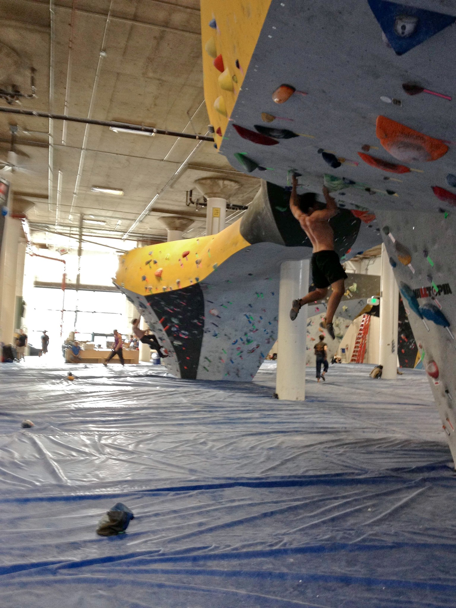

On Friday, Alex and I headed into San Francisco to check out the relatively new touchstone gym called Dogpatch Boulders. We met up with Marina, who also happened to be in the city. Dogpatch hosted a comp about a week before, so we all got to jump on the comp routes.

This gym has a lot to offer with over 14,000 square feet of bouldering. If you haven't done so already, I suggest you go check it out!

\- Eden
