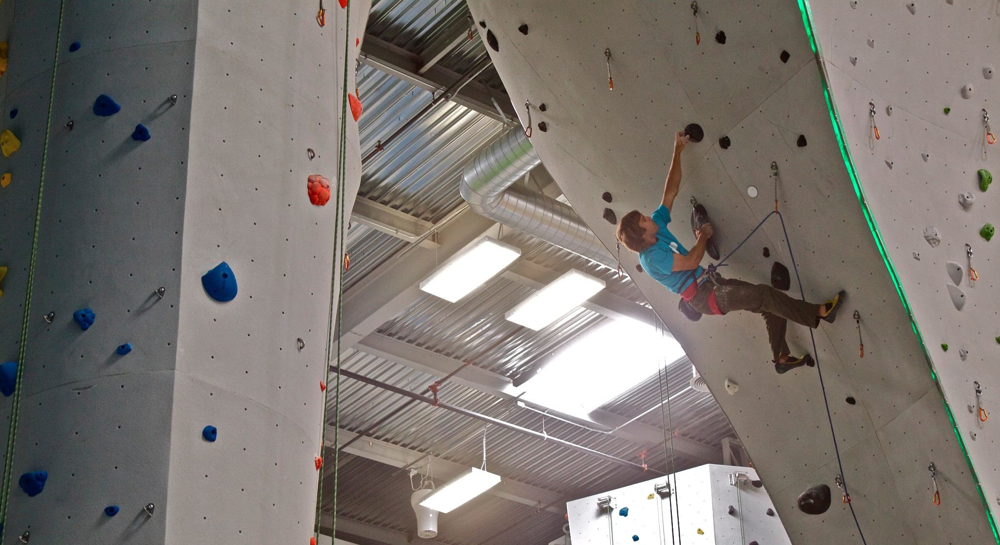
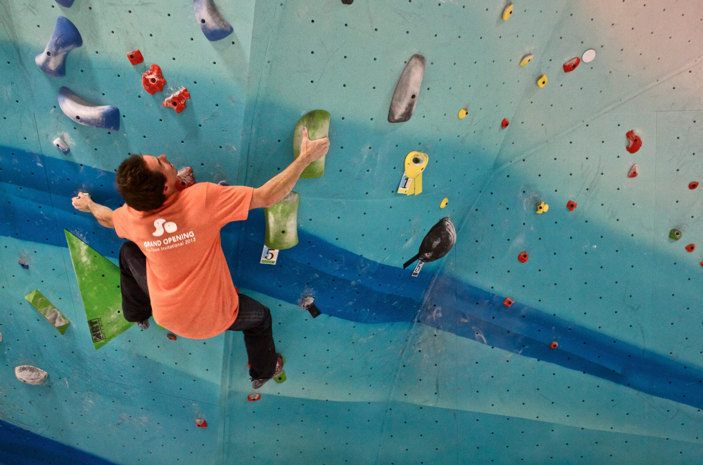
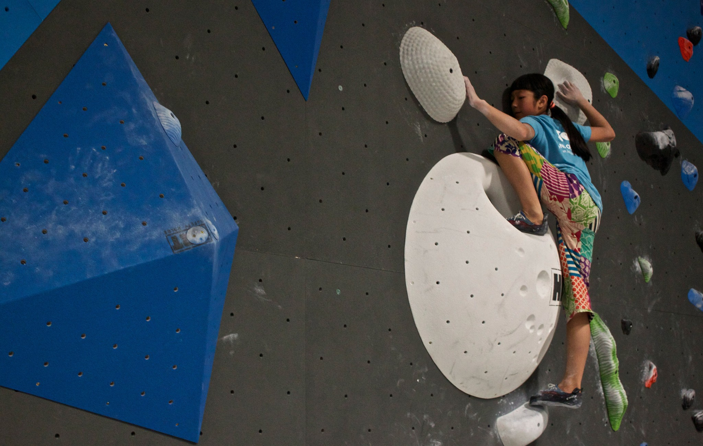
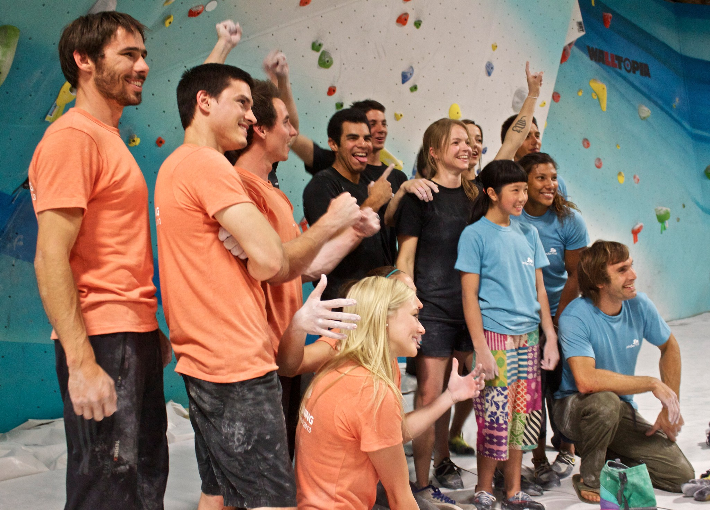

Marina, Jake and I arrived in Santa Ana at 10 am this Saturday with a long but exciting day ahead of us. It was the grand opening of Chris Sharma’s new super-gym, Sender One. There was already a crowd outside, waiting to climb on the futuristic Walltopia features. And with the gym reaching its full capacity by noon, the staff was hard at work with non-stop belay tests and floor monitoring.

Everyone took a break to watch Sharma lead two climbs through the sweeping arch and cone.

The Pro Comp kicked off at 7 pm, with a fun new team format. There were three teams of five, with limited amount of time and attempts to rack up as many points as possible.

If you missed the grand opening, be sure to check this gym out some other time. It is truly one of a kind.

\- Itai
