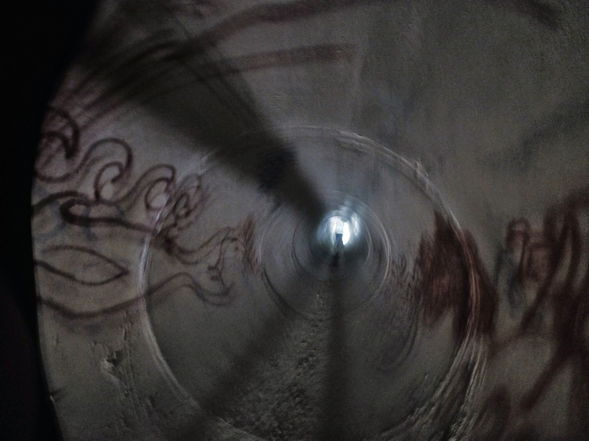
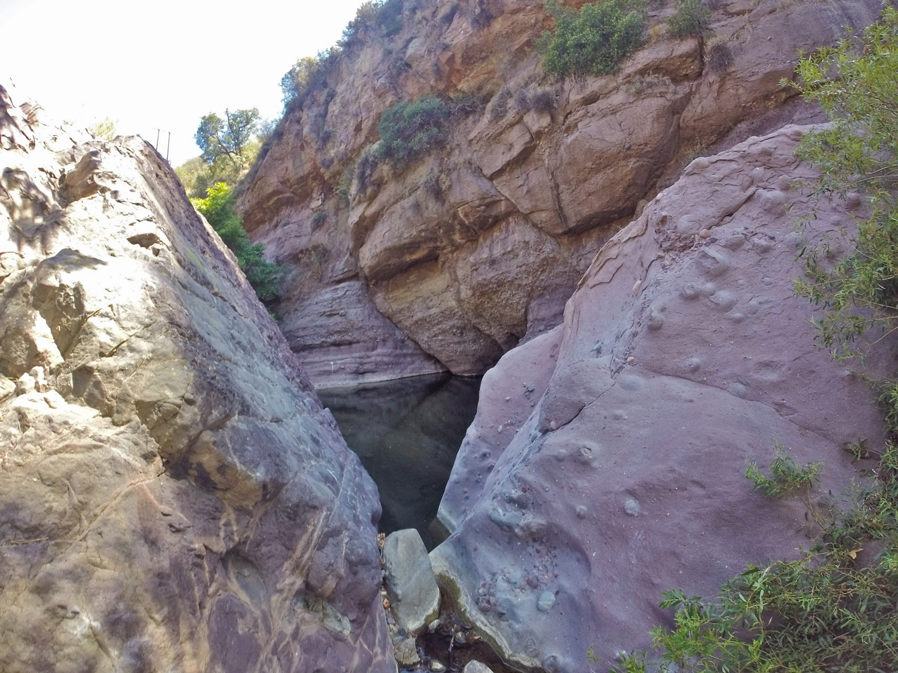
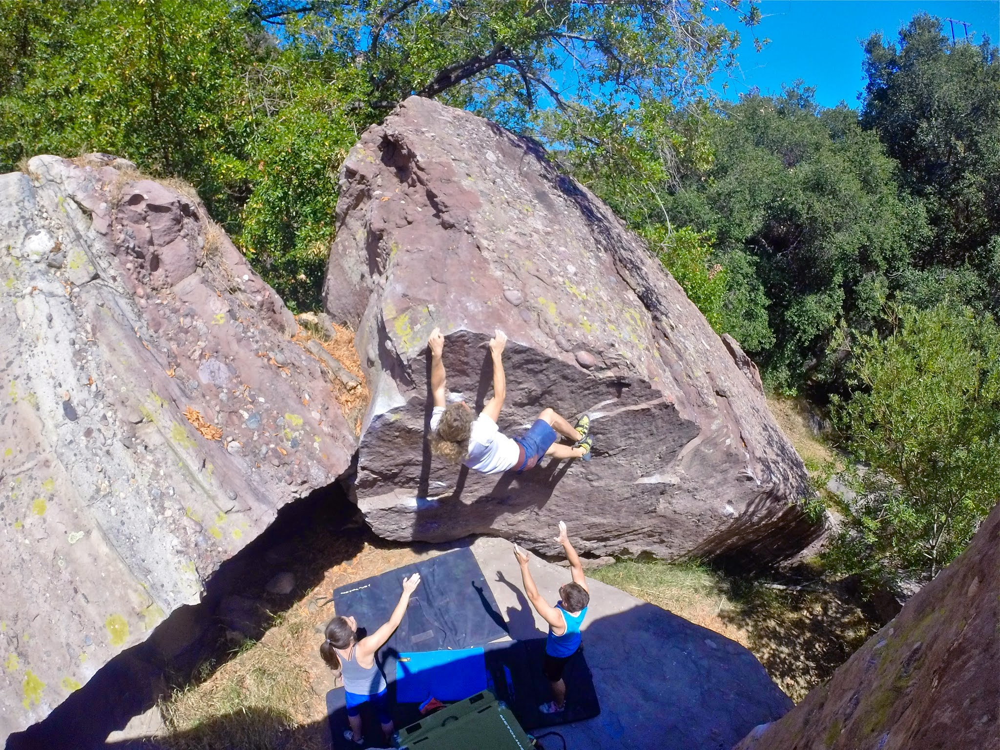

Hmmmm, the Purple Stones, where to begin?

Last weekend I headed to the Purple Stones with Marina, Jake and Alex. This was our first time exploring this local crag, and we were eager to get outdoors for the day. Little did we know that we were about to have quite an adventure - perhaps one that is more fit for Bilbo Baggins than a group of spoiled LA climbers.

The approach begins alongside Topanga Canyon highway, where one is forced to partake in a live game of frogger. Next, you must descend down a long and ominous drainage pipe, which really puts your hobophobia to the test. ~~When~~ If you emerge, you then follow a creek for about 15 minutes, after which you finally reach a cluster of boulders that are purple - yes, purple. In fact, the Purple Stones are hypothesized to be the birthplace of A$AP Rocky. This should come as no surprise, since one of his most famous songs, "[Purple Swag](https://www.youtube.com/watch?v=KuZ2QZKYj7c)", very clearly pays homage to this mysterious crag. Anyway, here is a quick photo montage of our day.

By the time we reached the actual climbing destination it was fairly late and we were drained. Nonetheless we had a go at some routes. Here are some photos of the climbs we complained about.

Roses are red,

Violets are blue,

These boulders were purple,

I bid you adieu

\- Eden
