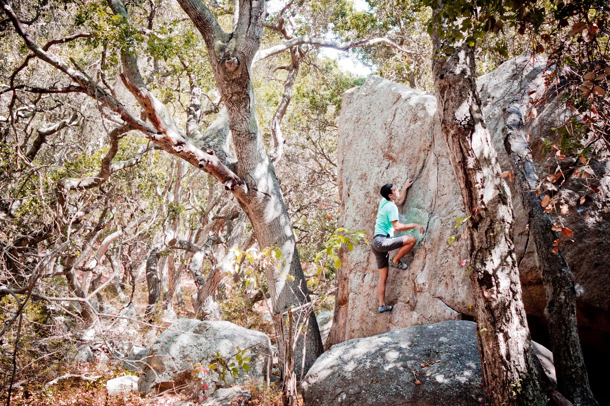
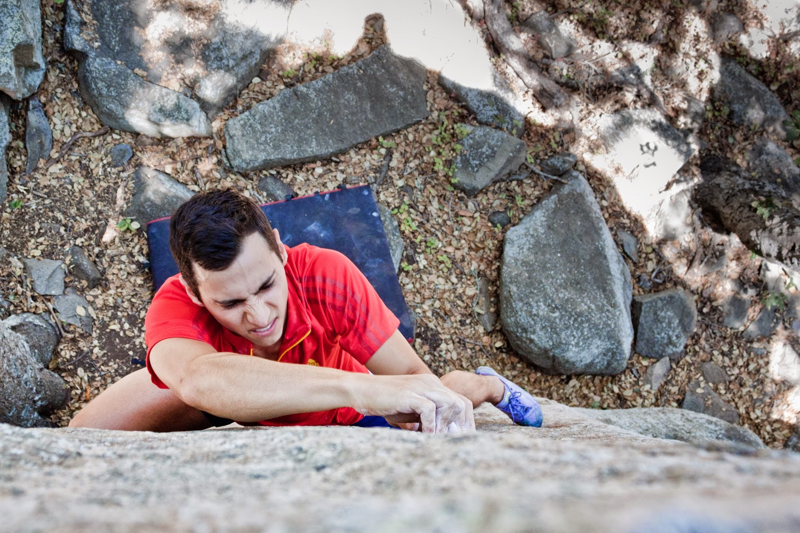
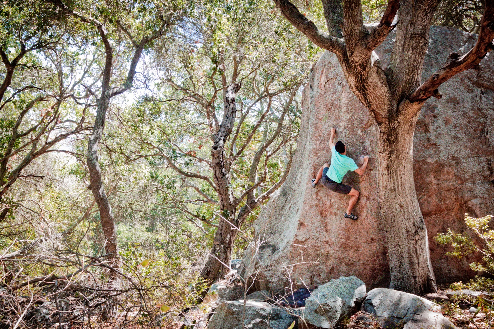

After four amazing years, it is time to say goodbye to San Luis Obispo. Luckily, before I left I got the chance to show my brother around Bishop Peak and reclimb some of my favorites.

I know Bishop Peak is not world class climbing, but I forget how spoiled I have been to have some rock 5 minutes from my apartment. I’m going to miss this place.

Goodbye San Luis Obispo.

\- Itai
