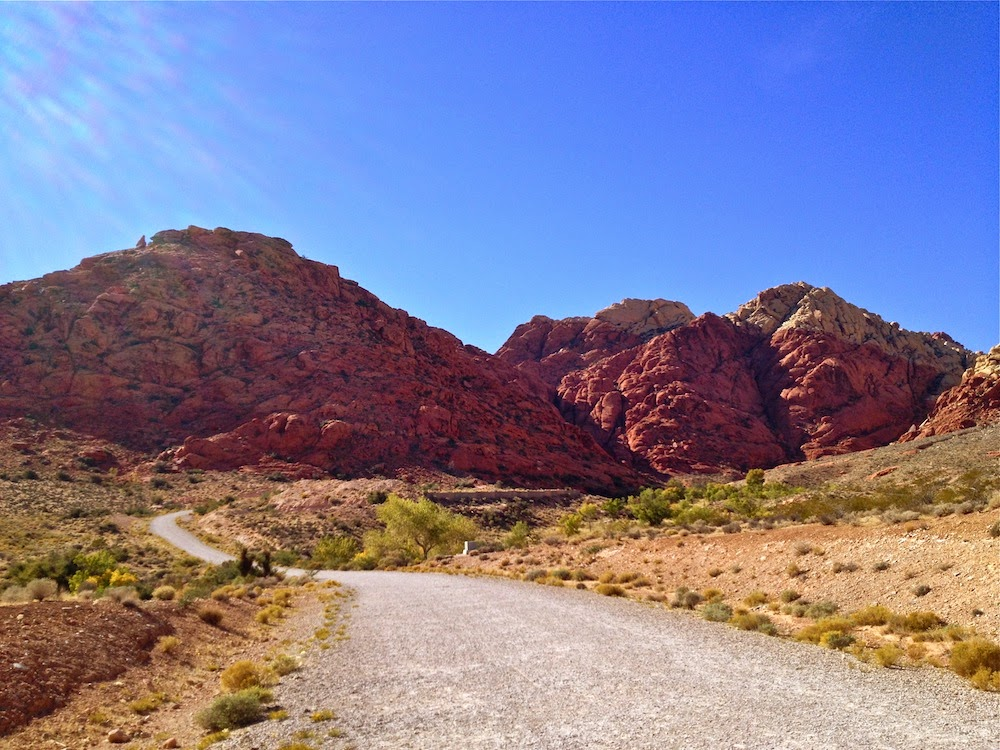
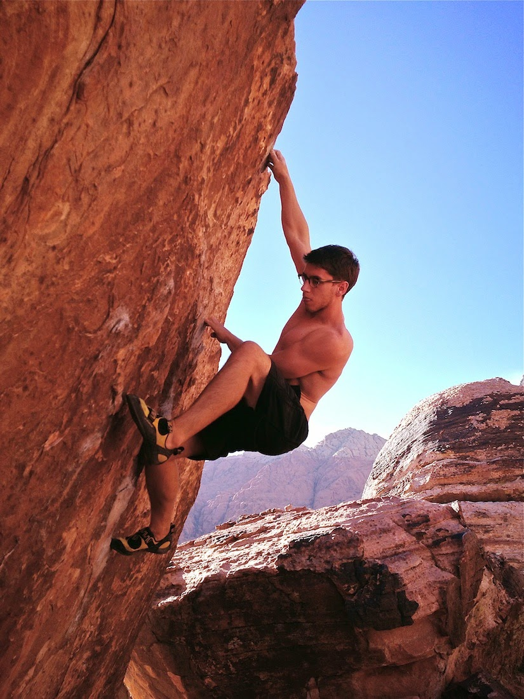
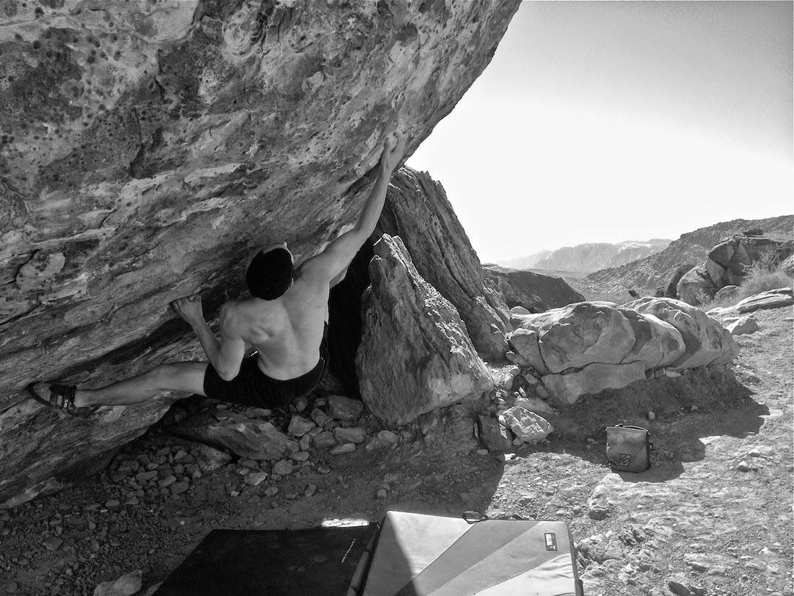
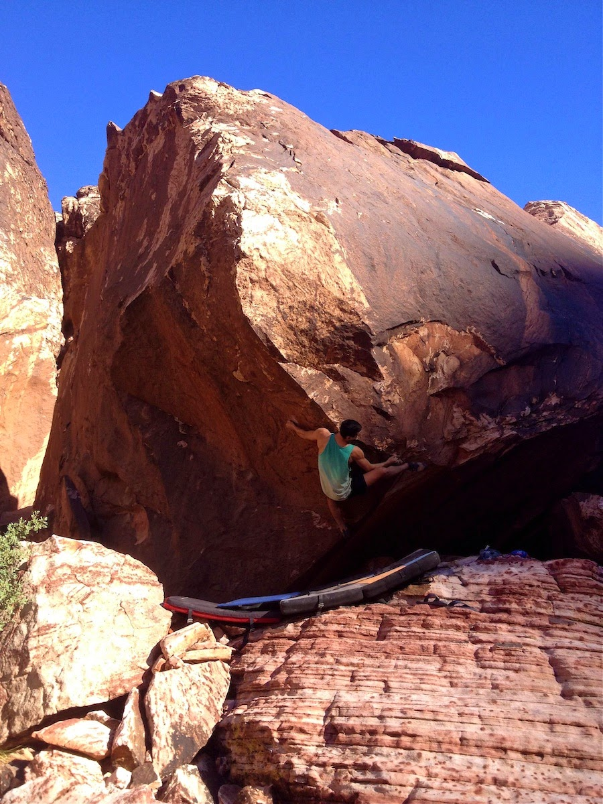
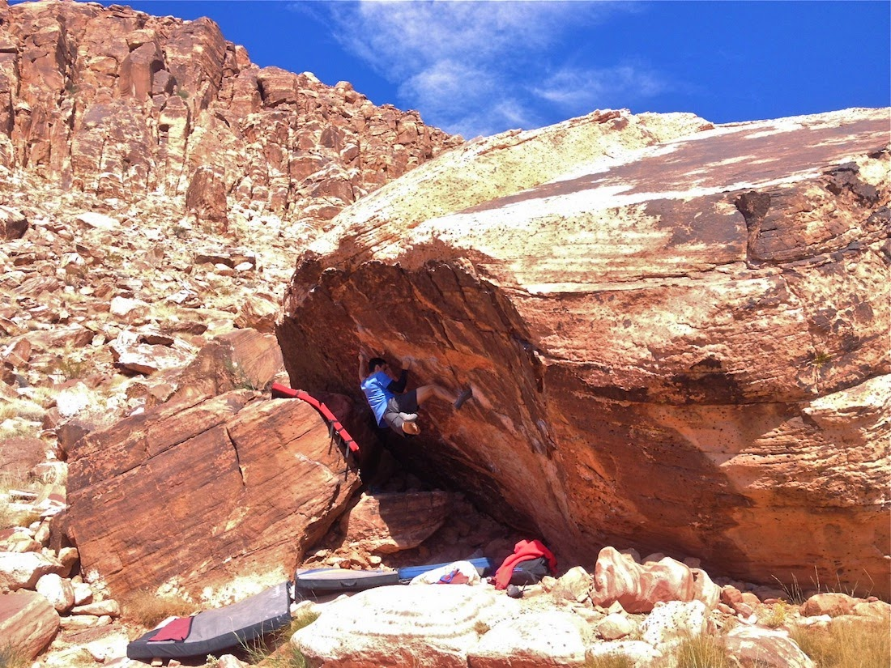

Is it fall yet? In the past I have been able to rely on my usual cues and signs, for example, if Starbucks is serving its seasonal pumpkin spice latte, temps are usually favorable. However, we're already in late October and fall temps appear to be hanging back like a reluctant child on the first day of school. Don't worry fall temps, we won't bite!

This past weekend Marina, Jake and I scoped out a warm Red Rocks for the first time. Red Rocks lies about 15 minutes west of Las Vegas, and offers a plethora of climbing. The magnificent sandstone formations and canyons provide a serene refuge from the wilderness that is Las Vegas. The contrast between the city and the surrounding desert is striking. Over the four days of our trip I began to understand the true severity of the juxtaposition.

On day one we headed out to the main cluster of boulders in Red Rocks (Kraft Boulders). We warmed up and jumped on some of the area classics. It was a hot day, but we managed to chase shade and get a solid session in. Jake and Marina opened up a couple projects on the popular Monkey Bar boulder, and I snagged sends of Monkey Bar Direct (V8) and Timmy's Problem (V9).

Day two was just as hot. We started off at the Monkey Bar boulder, where Jake put down the Monkey Bar Traverse (V6/7). After that we headed deeper into the canyon to avoid the sun and explore the Gateway boulders. Foolishly, I wanted to check out Book of Nightmares (V12), an appropriately named climb. I worked the opening moves, but left the rest for later, in case I ever return with ~~more pads~~ a parachute. On the way out of the canyon my flip-flops decided that hiking was not what they signed up for, RIP, but half a role of tape later and they survived one last push out of Red Rocks - before I dumped them in a Walmart trashcan for an upgrade.

On day three I wanted to jump on Scare Tactics (V10), and headed there early while it was still in the shade. We ran into another SoCal climbing crew, and I got to work out the sequence with a fellow climber - Aaron. We both put down the crimpy climb in a short session, and then we all headed toward the Monkey Bar boulder to find shade in the overhang. Marina worked out the sequence on Monkey Bar Traverse (V6/7), and Jake sent Monkey Bar Right (V6).

On the last day we were all pretty sore and tired, but we still had a short session in the shade of the Monkey Bar boulder. After that we headed home for a much needed rest. This was a great trip, and I can't wait for the temperatures to drop a bit more. I'm glad I finally made it out to Red Rocks, and I'm certain I'll be back soon.

\- Eden
