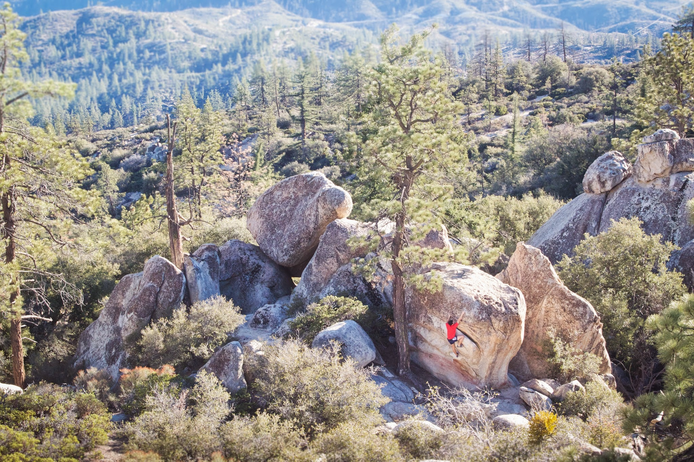
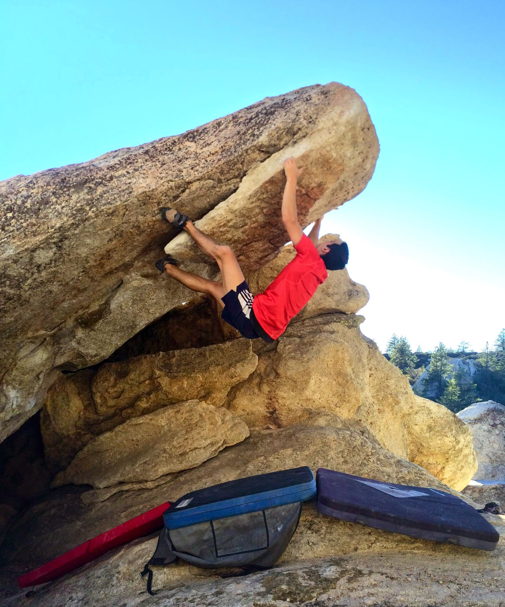

Cody, Eden, Jovanna and I escaped the Los Angeles concrete jungle in hopes of spending our Saturday in a place with a scenic view. We decided to check out Horse Flats and were not disappointed by the granite boulders of the Angeles National Forest. We tried to get on all of the classics the area had to offer but the heat slowed us down and left us with plenty of climbs to return for. Here are some pictures from the ones we got on

I can’t wait to get back out there with cooler temps and more skin (and with more pads for Sword of Damocles).

\- Itai
