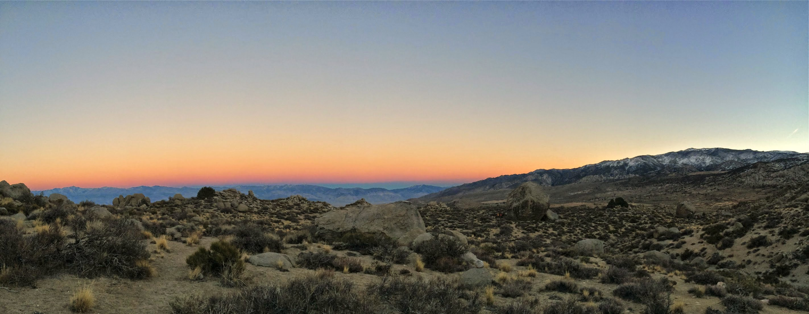
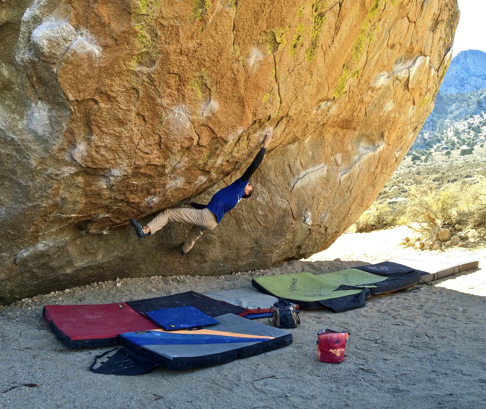
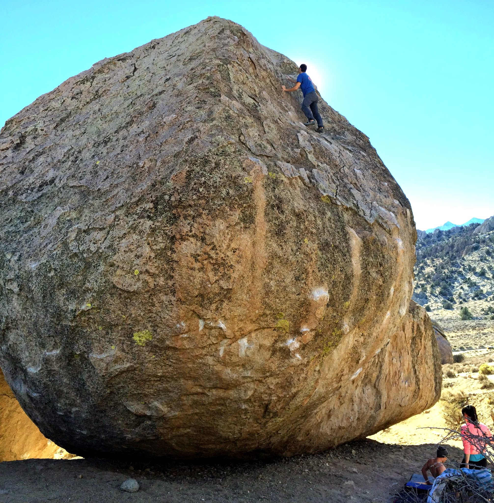
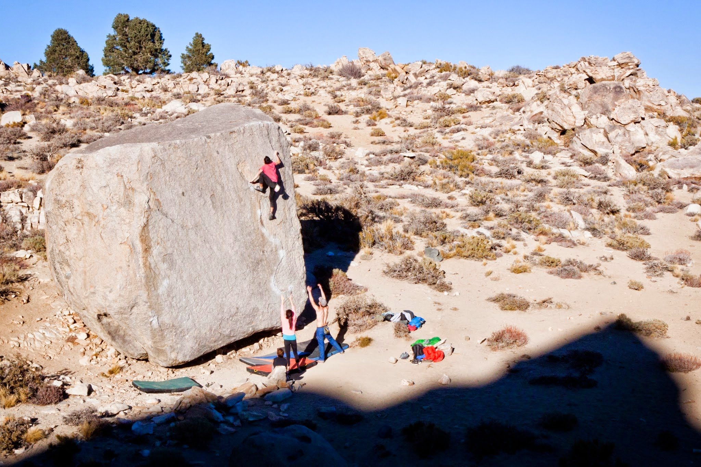
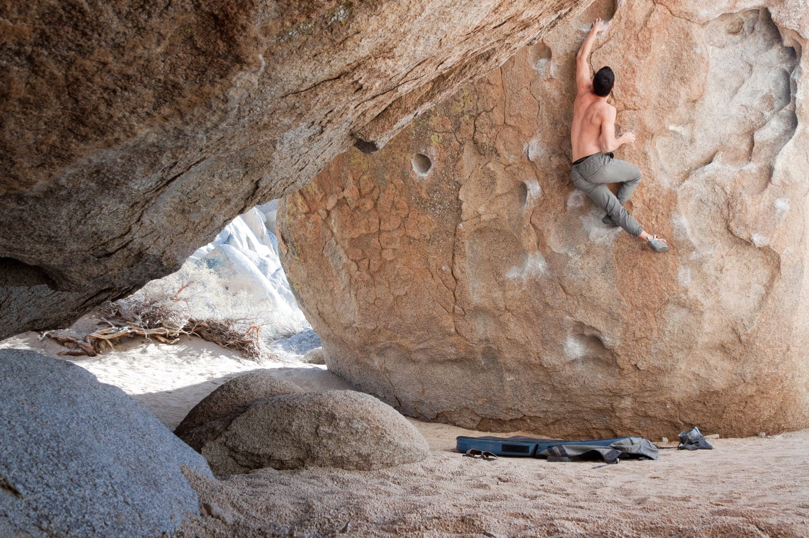

This past weekend I headed up to Bishop with my brother. We had the pleasure of meeting up and climbing with a solid crew, including Dan, Isaac, Marina and Jake. The weather was nice (?) and the psych was high. (If you need visual proof, here's a pic of the group posing in front of the Peabody boulders --> <http://i.imgur.com/H5ozEpf.jpg>).

This trip I was on a mission to dispatch my old nemesis, Direction (V13), so naturally, it was the first thing I stepped up to. After a few warm up goes, and some beta advice from my brother, I finally managed to put the project down! But since I find it hard to express myself without emojis, here's something that will help convey what it feels like to send a long standing project (play your favorite jam in the background for an enhanced effect):

Seriously though, thanks for the support everybody! Here are a few photos from the send...

After the send I took some time off to relax, take photos, and cheer the guys on. Here are Marina and Isaac getting close on their respective projects.

Later that day we headed out to the Pollen Grains. I hadn't been out to this area in years and I was excited to jump on some fresh classics. Itai and I managed quick sends of Return of the Jedi (V10), and later joined Dan to work out the moves on Spectre (V13).

On Sunday, Itai and I hiked out to the Secrets of the Beehive area to check out The Swarm (V14). We gave the problem a few goes each, and then decided to check out other climbs in the area. I really can't wait to come back to it with more skin and better crimp strength. The next project?

After our adventure in this outlying area we went back to the main Buttermilks to meet up with the rest of the crew. We ended the day by laying out in the sun and contemplating life's great mysteries.

I can't wait to get back out there. Let's keep 2015 rollin'!

\- Eden
