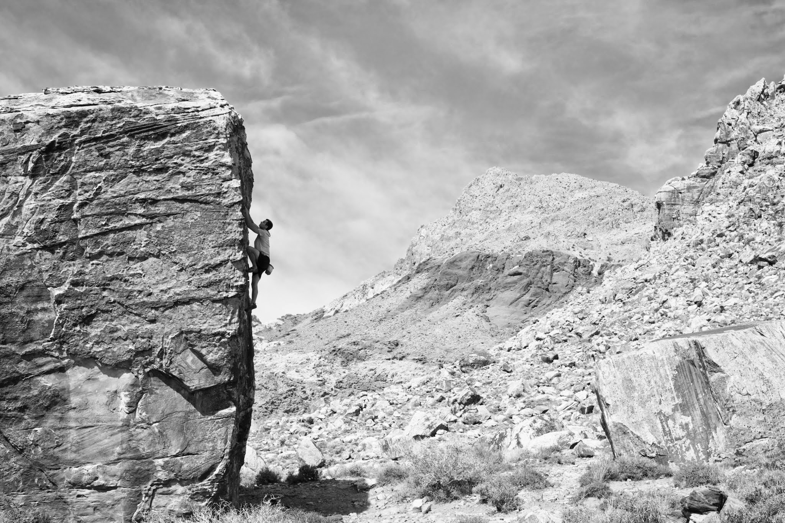

My brother and I arrived in Red Rock Canyon mid-day, excited and ready to climb, but as we hiked the short approach into Pine Creek Canyon, our enthusiasm was dampened by the heat. We had our eyes set on a short and powerful problem called Siren's Call, but unfortunately couldn't manage a send before the 7 o'clock Red Rock Canyon National Conservation Area closing time.

We awoke the next morning and ventured out into the Kraft Boulders in search of a shady climb. We played around on the Monkey Bars boulder before it got too crowded.

By mid-day the heat was unbearable and we decided to toss in the towel and head to the Las Vegas strip to join a group of friends by a pool. It looks like the end of the season is upon us.

\- Itai
