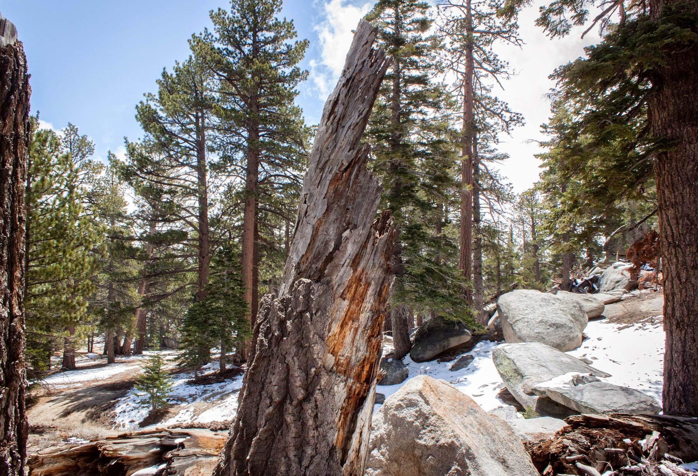
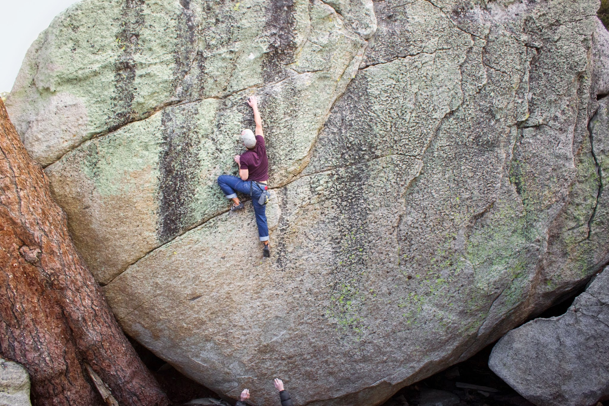

The San Jacinto Mountain range received several inches of snow from a brief and passing storm but the weather forecast now promised blue skies and good climbing temps. Emily, Jake, Cody and I took this opportunity to escape the city and travel up the Palm Springs Aerial Tramway to 8,500 feet and try some quality granite bouldering. We got an early start and were looking forward to the full day ahead.

After warming up we all began working our respective projects but came away without sends and plenty of climbs to return for. By the afternoon the temperatures had dropped and so had our energy, so we opted for some easier but scarier climbing.

On our way out (after getting lost for a bit) we couldn’t resist trying just a few more classic lines.

I hadn’t been to Tramway for around 7 or 8 years and I’m hoping it takes me less time than that to get back there. How bout next weekend?

\- Itai
