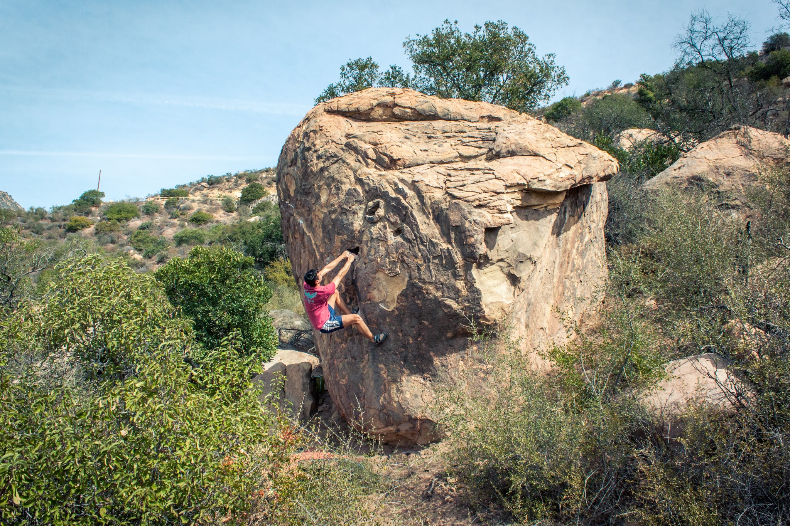

This fall, Eden and I made a quick trip out to Santa Barbara. We explored the area known as The Creamery that sits just bellow the Brickyard and Lizard's Mouth. Our primary goal for the trip was the area test-piece, First Come First Served. This gem of a problem was put up by SB local strong man, Thomas Townsend. Here are some photos from the quick trip:

