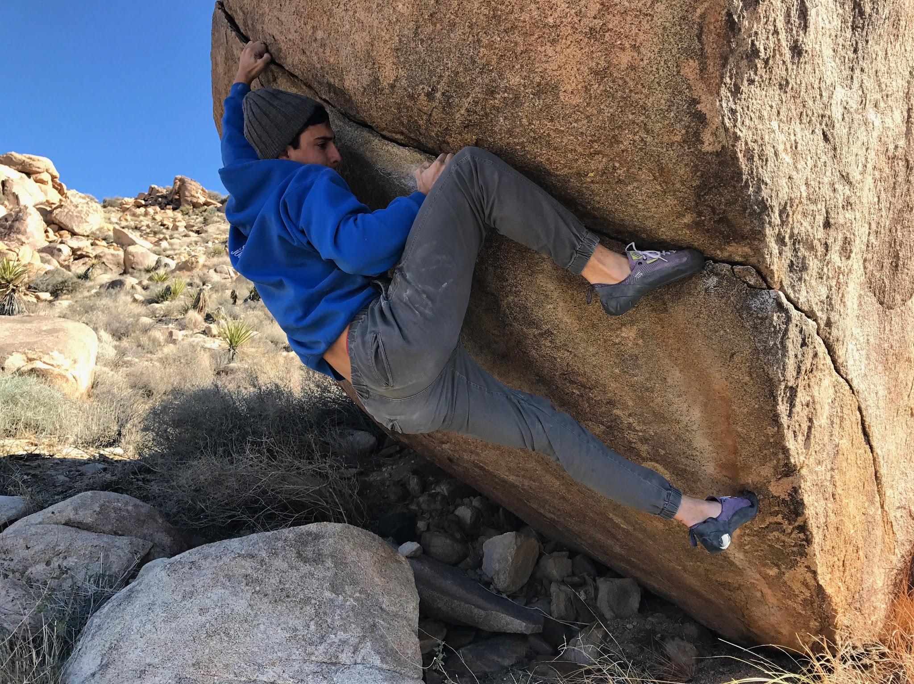

Itai and I headed out to Joshua Tree for a quick day trip on Sunday. Our main objective was to find and try out a project located somewhere beyond the Phantom Carter Boulders near the entrance of the park. We ended up spending the vast majority of the day hiking around and feeling completely lost. The boulders were nowhere in sight, and the guidebook was no help.

However, during one of our pit stops, I managed to snag a send of Blood Diamond (V10) - a redeeming quality to an otherwise frustrating day. This beautiful problem follows a thin seam from start to finish, and requires some crimp strength and willing tendons. Highly recommended.

With about 45 minutes of daylight left we decided to throw in the towel on finding this incognito "project", and spent some time messing around on roadside boulders.

I guess sometimes it's more of a hiking trip than a climbing trip, but that's okay too.

\- Eden
