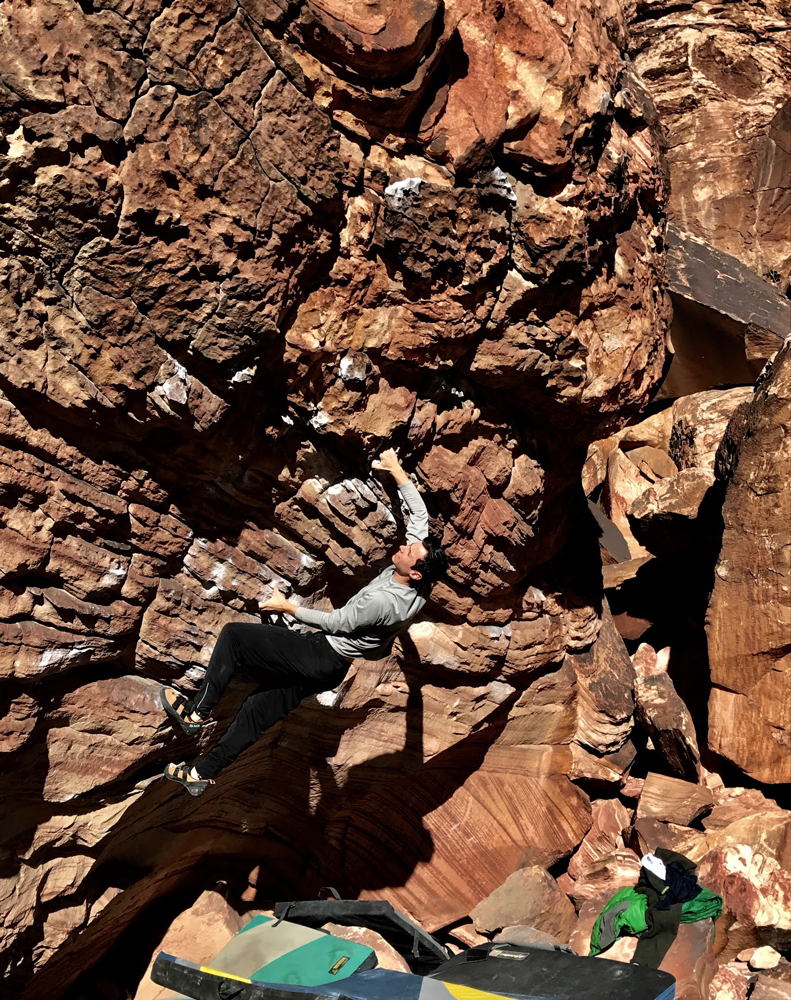
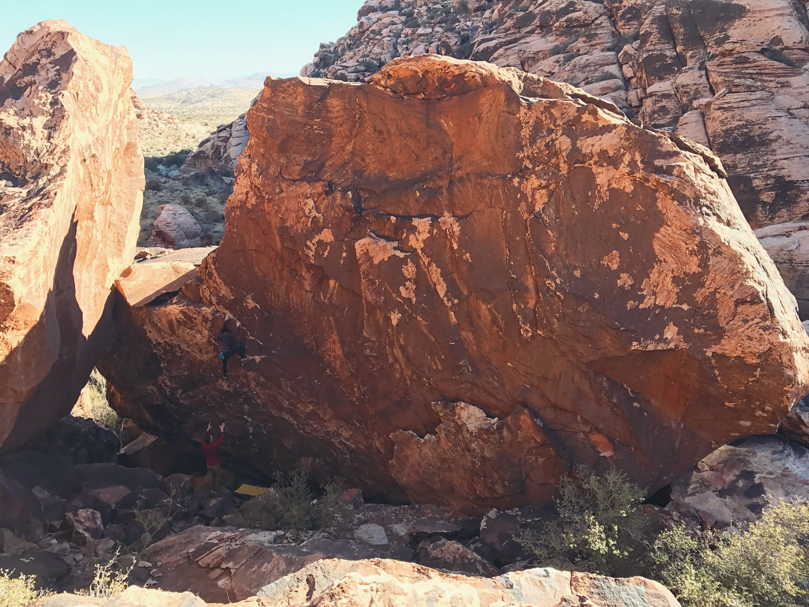

Cody and I returned to Red Rock Canyon for some sandstone bouldering for our new winter time tradition. This seems to be a tradition not just for us, but for about 10,000 other climbers so we started off the trip high above the Kraft area boulders to escape the crowds on Bitch Slap 5. This route is a fantastic power endurance test piece and certainly deserves its three-star rating in the guide book. After working through the beta in my head I pulled off a flash, not a bad start to the trip.

We felt pretty worked on our last day but I was still able to muster up the energy to send American Exotica in the heat of the noontime sun. I then worked out all the beta on Lethal Design but will have to return fresh to tick this climb off. I'll also need to train my endurance.

Hope to get out there again soon.

\- Itai
