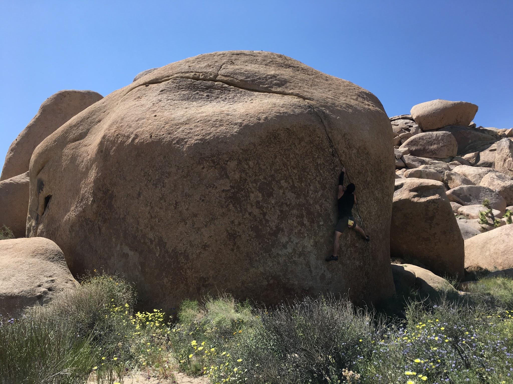
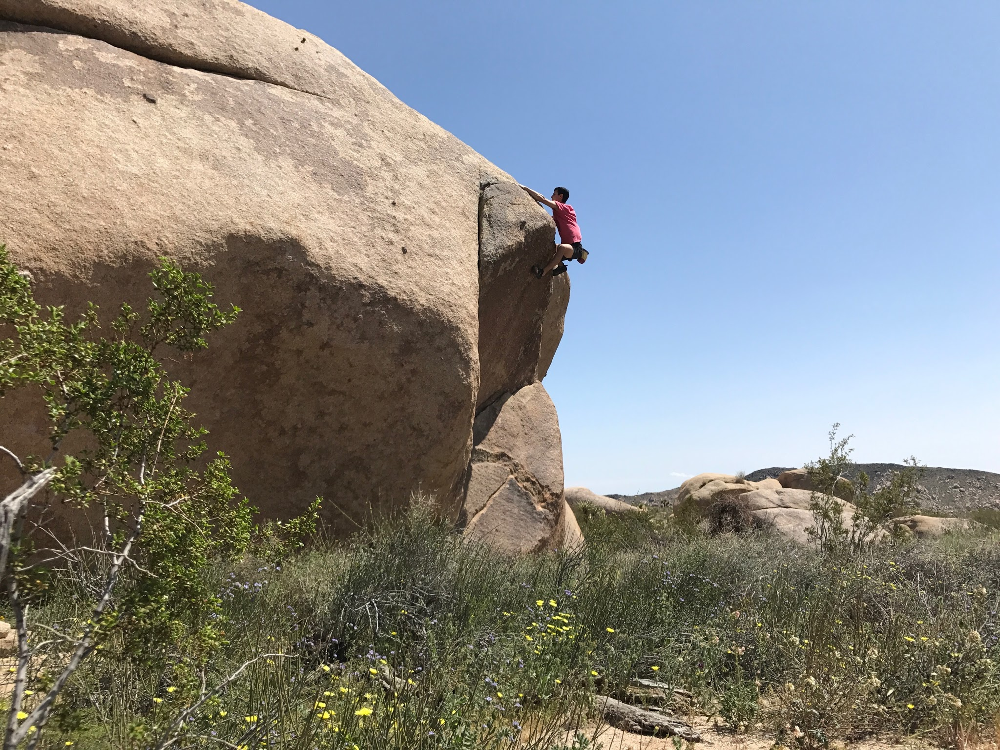
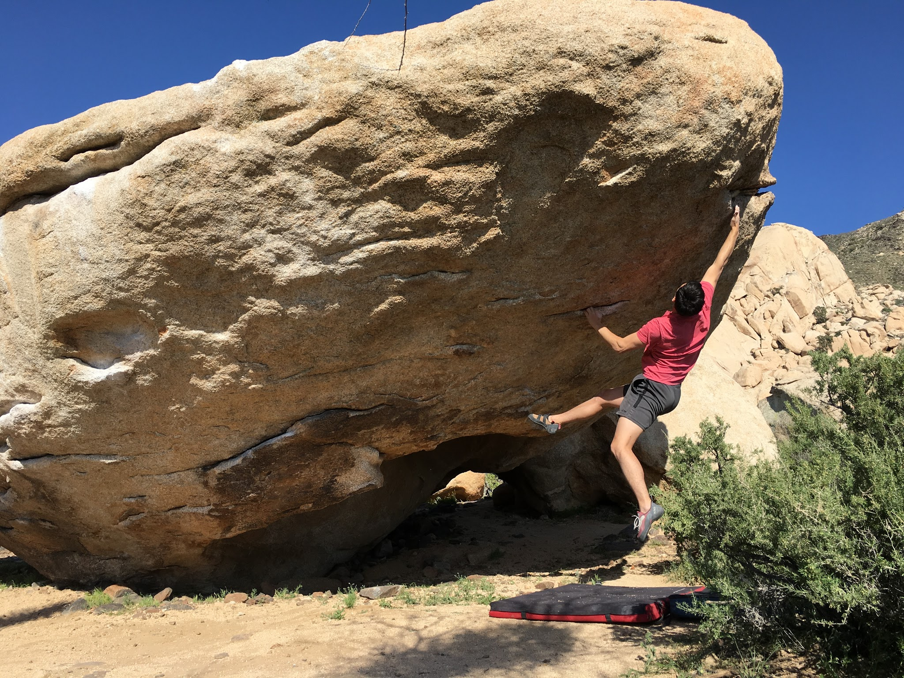

Itai and I ran out to Joshua Tree yesterday for a day trip in the desert. When we arrived, the weather was beautiful and the wildflowers were blooming.

We started the day at intersection rock, where I got to jump on Yogi (V10), a physical roof problem. Itai showed me the beta by essentially repeating the climb, and I was able to send pretty quickly!

After that, we decided to check out an area that was new to us - Geology Tour Road. We had fun jumping on new problems and exploring the region.

For our last stop of the day we headed out to Hall of Horrors where we decided to try Nicole Problem (V10) - a crimpy one-move-wonder with the potential for a sit start (has anyone done it?). We spent some time fine tuning the beta, and both sent!

Overall it was a great day out in Joshua Tree despite the heat and the wind. Still so many new areas to explore after years of climbing here. Just goes to show how much there is to do in this park!

\- Eden
