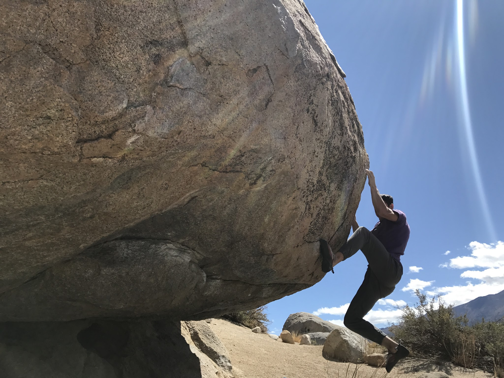
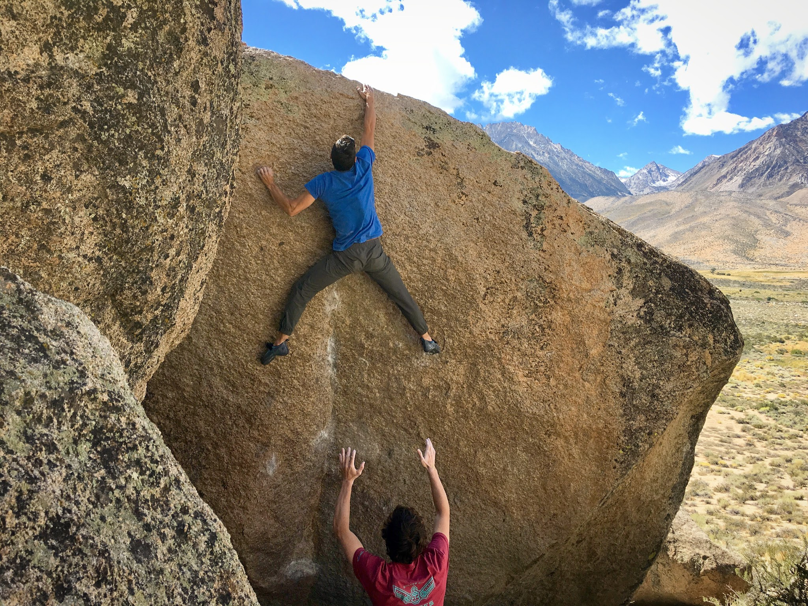
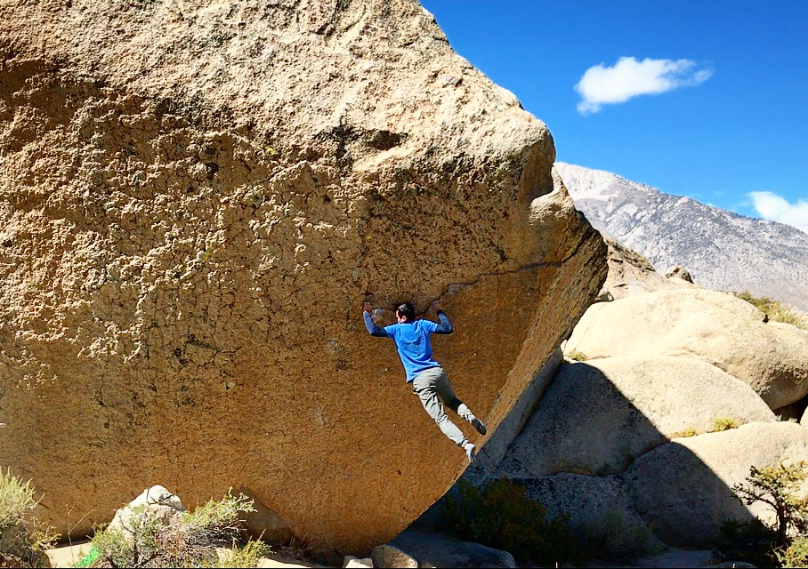

A cold streak appeared on the forecast and beckoned us towards the Sierras. It was the last weekend of our seemingly endless summer and a Bishop trip would surely serve as a grand finale. Cody and I met Eden and Jovanna early Friday morning and made the familiar drive north on the 395. It was officially the first day of fall and felt like it when we exited the car for breakfast. Good climbing temperatures in September have been a bit of a rarity over the years but this was a welcome change. We warmed up in the Buttermilk main area and came away with some new climbs.

We then made our way over to The Mandala, an iconic Chris Sharma line that had thwarted me for years (Eden had sent the climb nearly a decade before). How iconic is this line? Well, it has its own [Wikipedia page](https://en.wikipedia.org/wiki/The_Mandala). I managed to put it down on my second go this trip. Jovanna sent both Hero Roof and the committing Sunshine Slab.

The next morning the group hiked out to the Secrets of the Beehive area where Cody made quick work of the intimidating Queen Sweet Nectar (V9). After a short warm up, my brother and I began to work the moves on the lifelong dream climb called The Swarm. It has been Bishop's hard crimp testpiece since it was first climbed. After trying the top moves of the climb for the first time I was able to connect it all from the bottom and found myself topping out. Looks like all of that hard work paid off! Eden fell past the crux (and second crux) four times in a row but was too tired to finish it this trip. It will surely go next time!

I'm sure we will be back to Bishop shortly!

\- Itai
