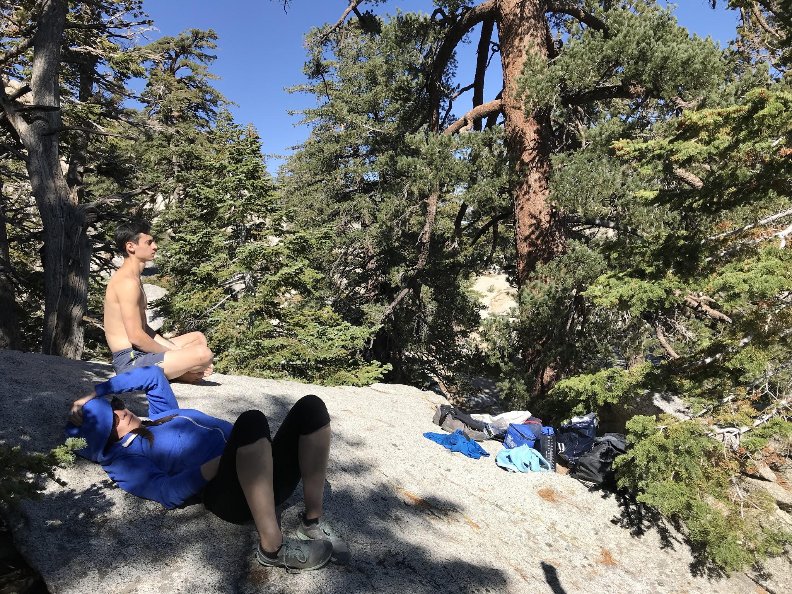
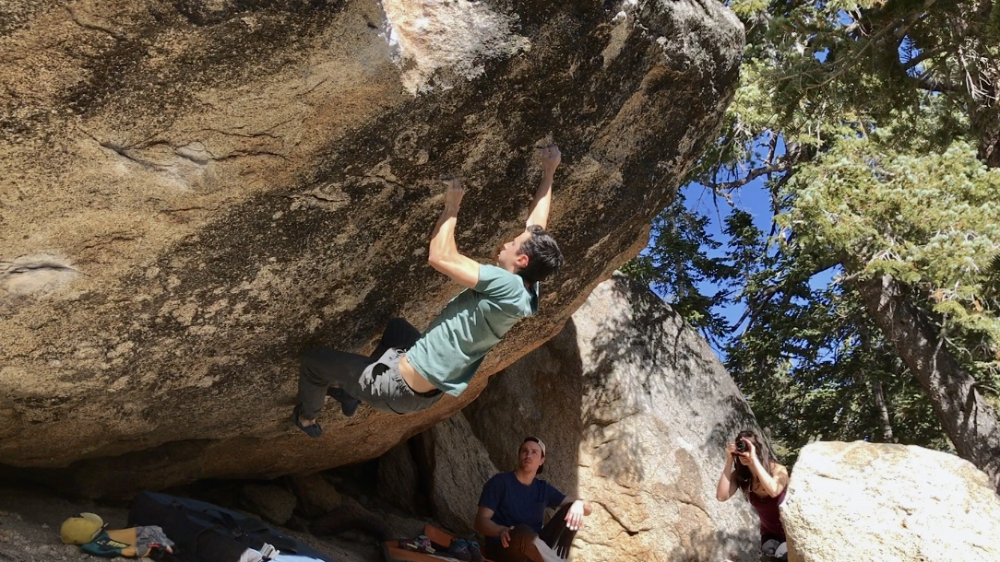

Eden, Marina and I headed out to Tramway with the objective of putting down Black Mamba. This Tramway crimping testpiece was originally done by Dan Mills many years ago and given the grade of V13, though consensus has settled at hard end V12 since then. The redpoint crux of the climb revolves around a low percentage dynamic move to a slot and can be very frustrating to work. The day was unseasonably warm, but after a tremendous amount of complaining, the project went. The uncut video of the send can be found at <https://www.youtube.com/watch?v=AONWzyMw2Dg>.

