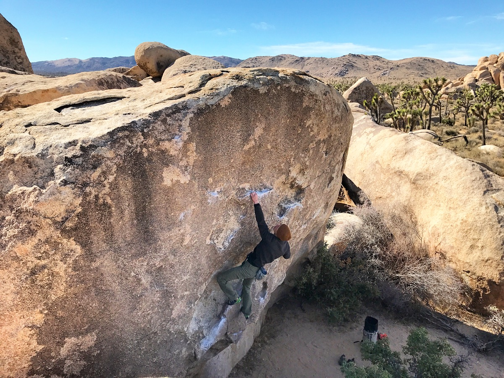

Cody and I drove out to Joshua Tree late Friday night to meet up with Joe and Sara. We had a wonderful weekend catching up with friends and mixing it up between bouldering and trad climbing.

The crew collectively had a very successful weekend out in the windy desert, I even managed to put down my nemesis rig, [Scatterbrain & Co. (V12)](https://www.youtube.com/watch?v=53HaeHYwFNo).

