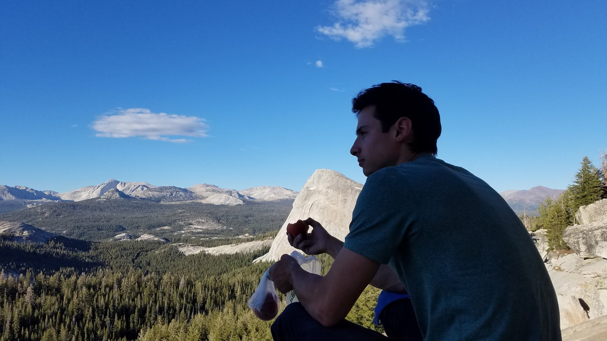
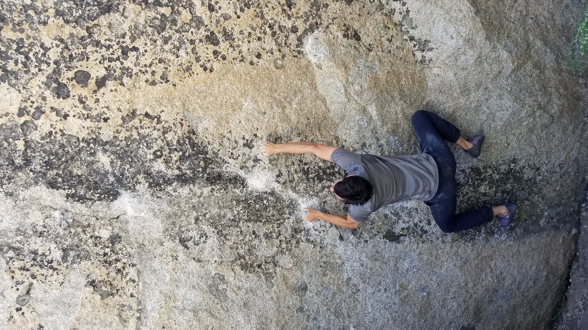

While I had been to Tuolumne before, I had strangely never climbed there. I finally got the chance to make a quick and successful trip up to The Meadows this summer. Most of the weekend was spent relaxing by swim holes and avoiding mosquitos, though I did get serious and came away with a flash of Galaxy 5000 (V10), Out of Your League (V11), One Love (V12), and High Lonesome Rambler (V12).

See Eden's video for his send of One Love [and more](https://www.youtube.com/watch?v=gHJ1KIYwyWY).

Till next time!

\- Itai
