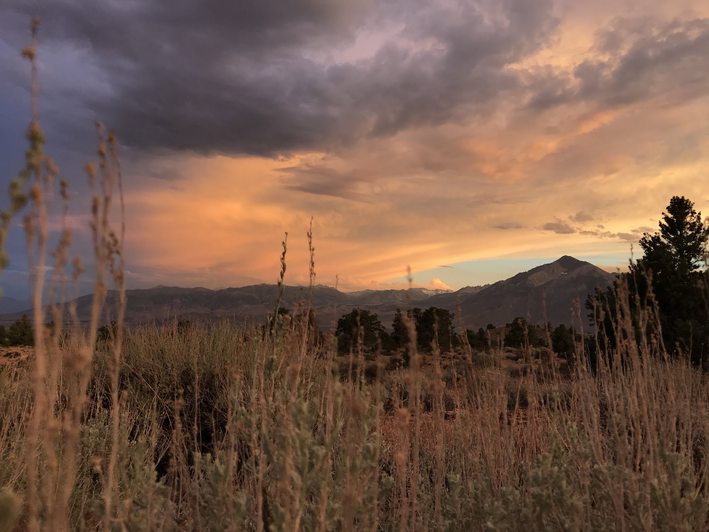
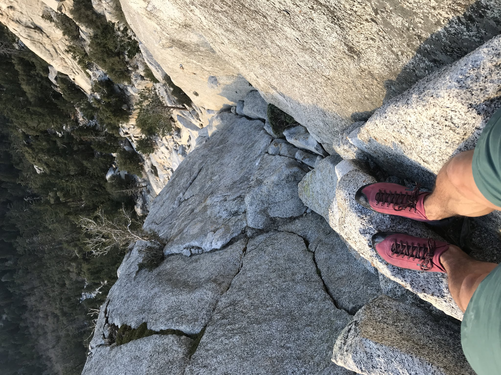
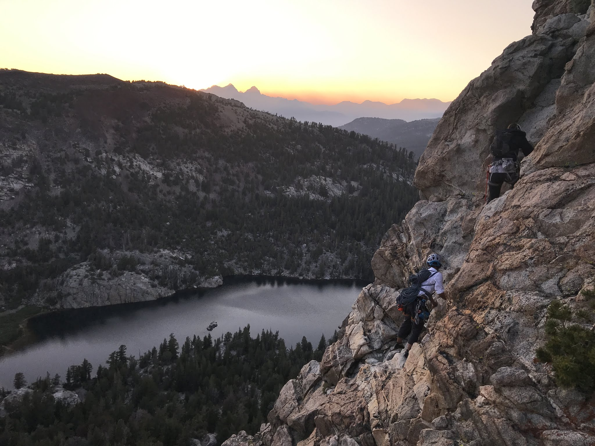
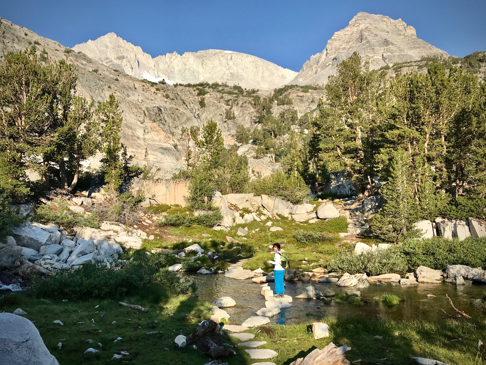
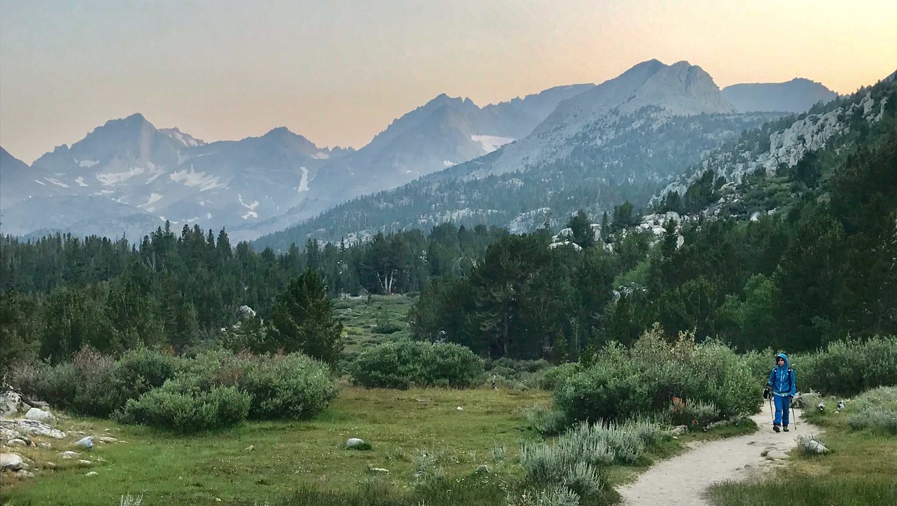

When it's too hot to boulder, we boulder anyway, but sometimes we retreat into the high Sierra instead.

Here are some uncharacteristic pictures of scenery, hiking, traditional climbing, and even some alpine adventures from the summer.

