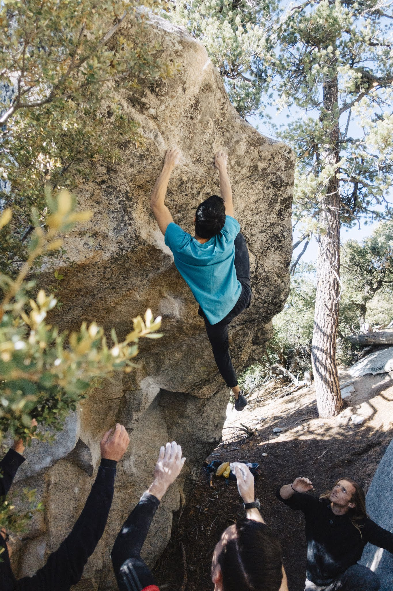
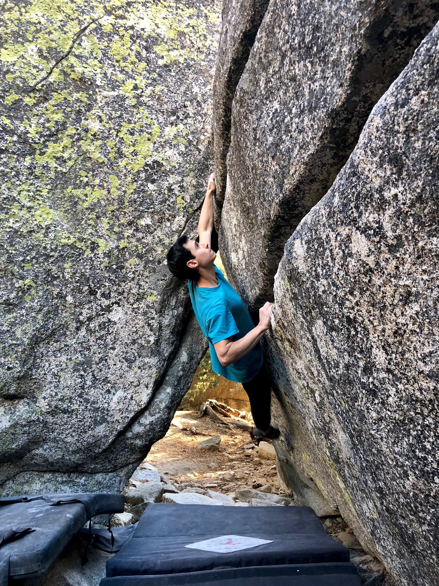

On Sunday morning I drove out to Black Mountain with Alex and Katie for a day of bouldering. We met up with Dylan, Mikey and Alex (A.) and got started!

We began at The Visor boulder where we warmed up and jumped on the many variations that it has to offer. By the time we left I managed to sneak in a send of Piss Mob (V11), a variation that exits the right side of the roof.

Our next stop was at the classic Ex Patriot (V10/11), where the crew put in a solid session. This line lived up to the hype and I'm happy to check it off the list!

We ended the day by checking out the Summit Corridor area. It offers many great problems like Wildcat (V8), Derailed (V5), Dekaled (V10) and the superb Brotherhood (V10).

I had a great day exploring some new areas and I can't wait to get back out there!

\- Eden
