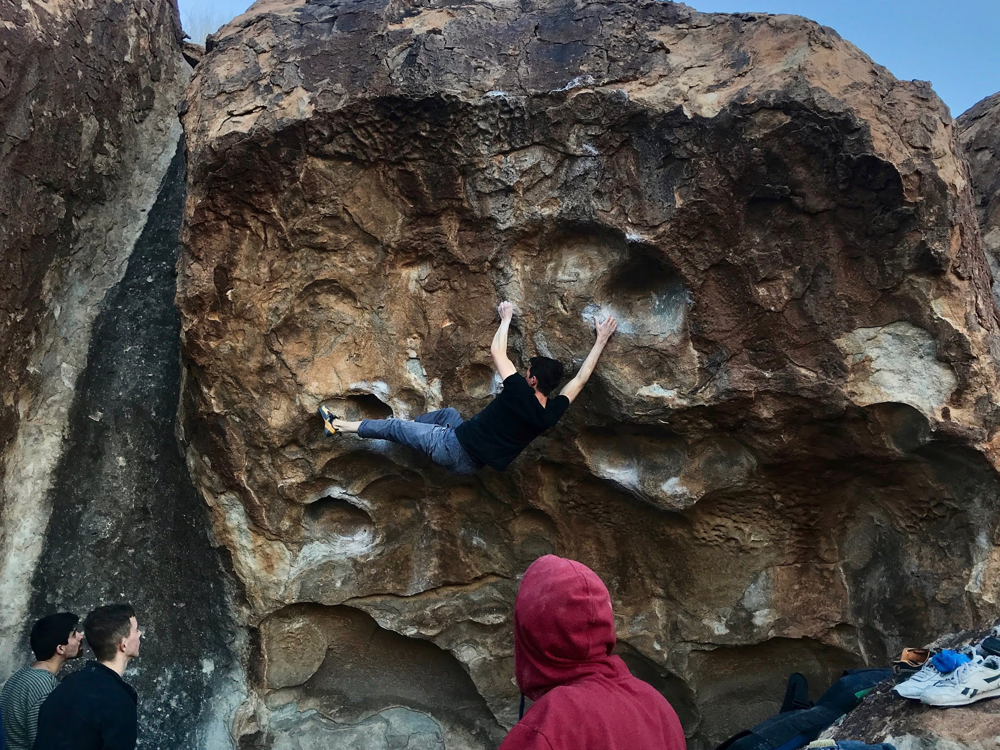
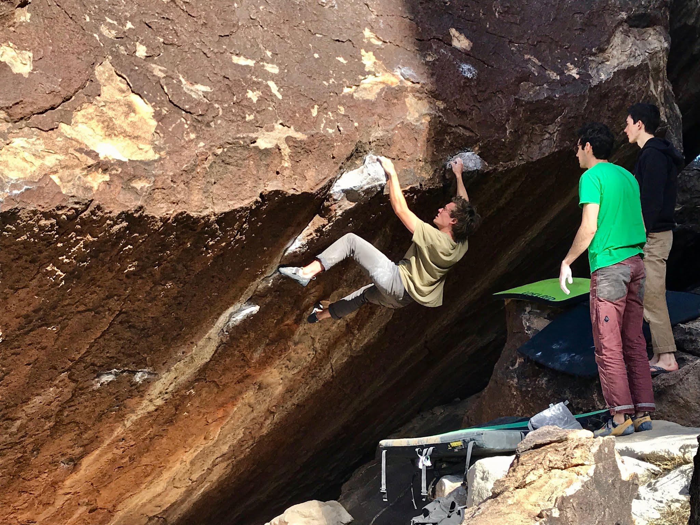

After a few rest days and a testing drive from Denver, I exited the car and pulled on to the classic Diaphanous Sea. It had been a decade earlier that I had last been to the desert bouldering mecca. That climb and many others had been on mind ever since. Aside from Diaphanous, I managed to tick a handful more off my list on the first day, including Power of Silence, a flash of Tequila Sunrise, and a flash of Loaded with Power (without any knee-bars of course).

Day two of the trip was spent on a tour to East Mountain where the whole crew got some mileage and sun. I was excited to come away with a handful of fun climbs, including a flash of New Map of Hell (V11).

A vertically shot video of some of the above-mentioned climbs can be found below:
<https://www.youtube.com/watch?v=Z85024Ynjv8>

We are resting our skin and avoiding the sun today, but stay tuned for updates later on in the trip!

\- Itai
