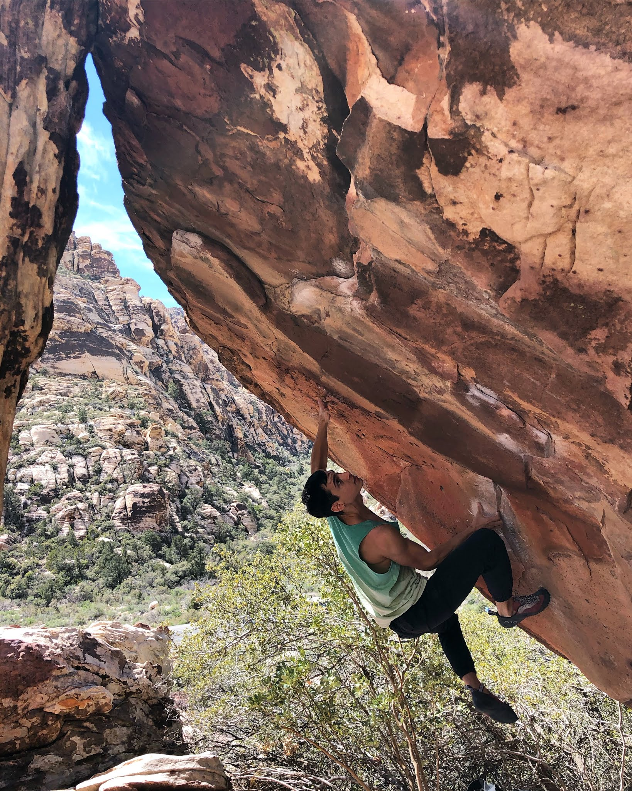
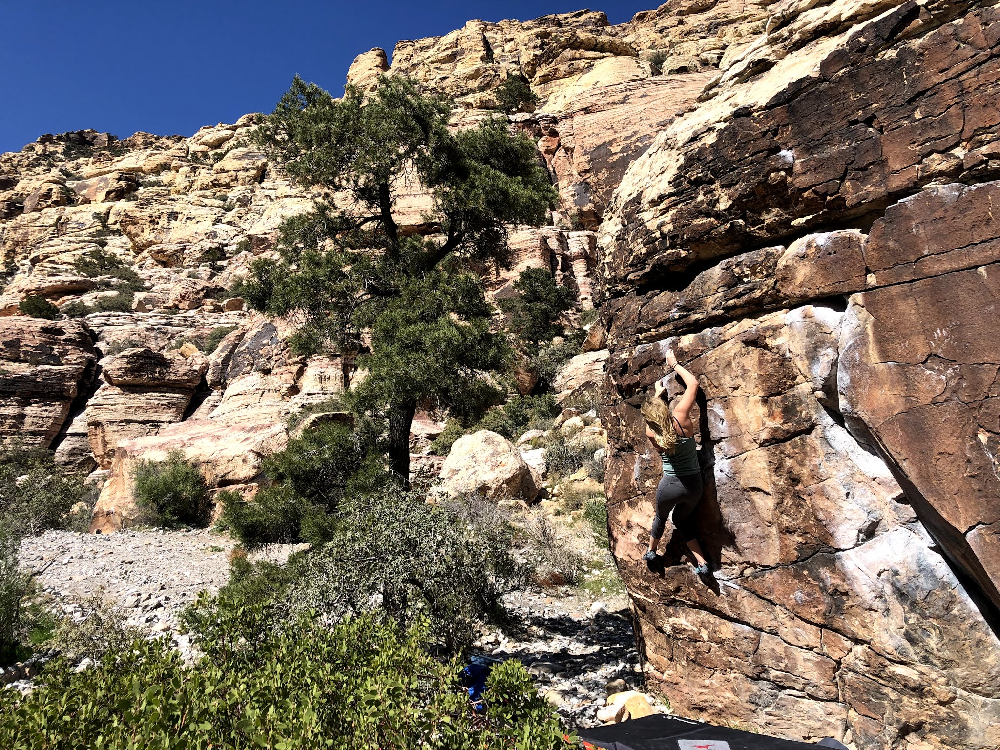
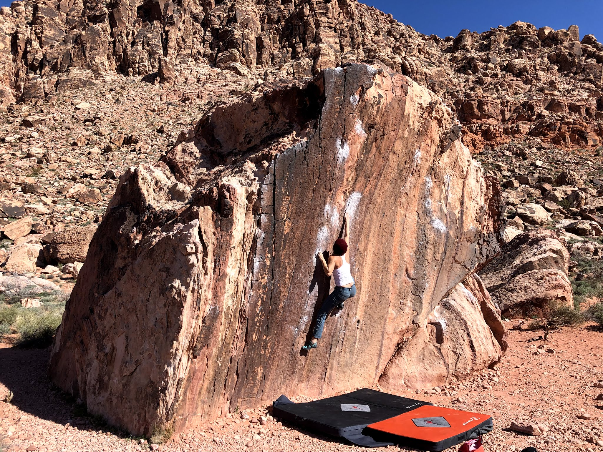
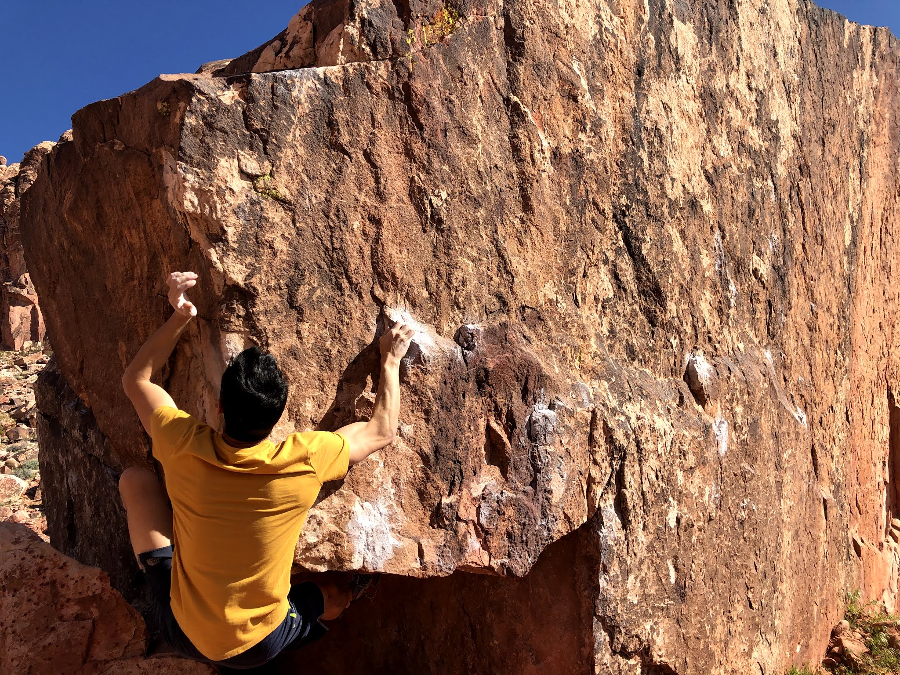
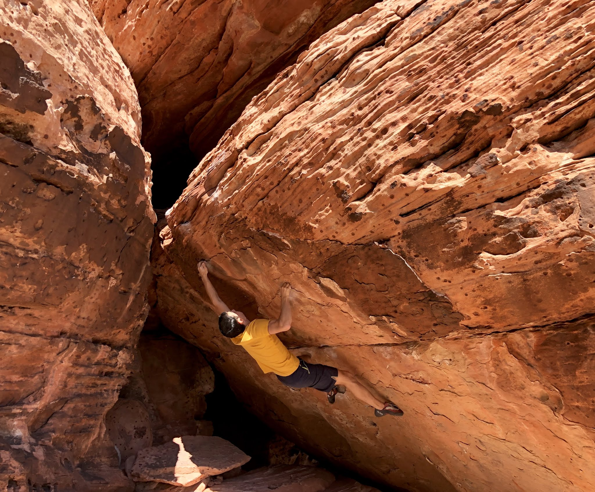
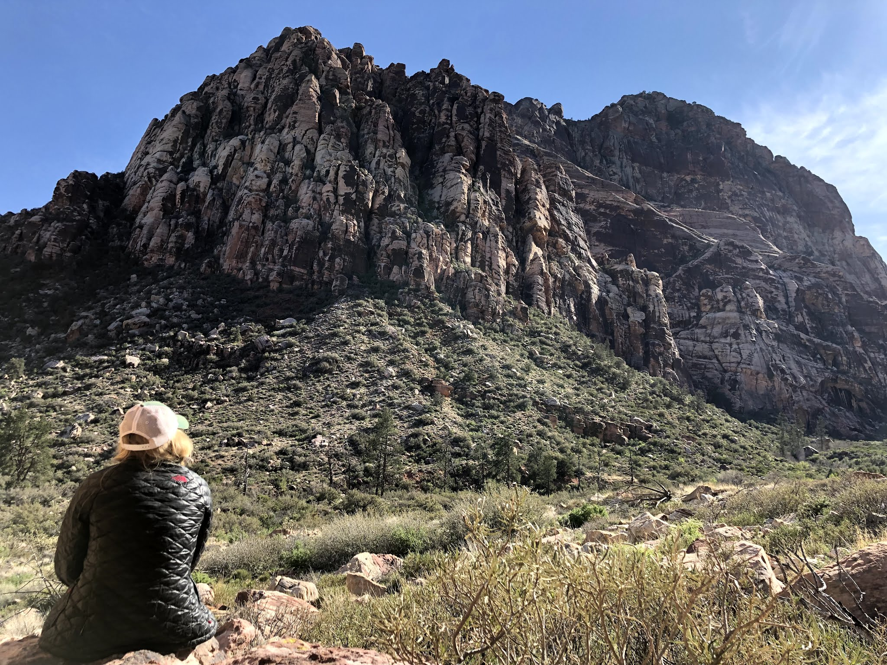

The original spring break plan was to be in Yosemite, but we had to bail on that due to campsite damage and weather. Because this happened relatively last minute, we quickly switched plans to Red Rocks and hoped for the best.

Jovanna and I drove up on Wednesday morning and checked out a (new to us) canyon in the scenic loop. In the afternoon we headed over to Kraft for a short evening session.

On Thursday we headed out early to try and beat the heat but were not too successful. It was a fun day scoping out new problems and chasing shade in the Kraft area before heading home. Friday was a much needed rest day after two days on at the boulders and a night out on the Vegas Strip.

Our last day in Red Rocks was Saturday, and thankfully the temperature dropped a little! I was able to piece together Woods Problem (V12) and flash Innocent Exile (V10). Jovanna gave The Pearl (V5) some more goes and tried out the classic Solange (V3). In the second half of the day we hiked out to Pine Creek Canyon where I tried Siren's Call (V11/12) and we both enjoyed the scenery and weather.

Can't wait to get back out there!

Eden
