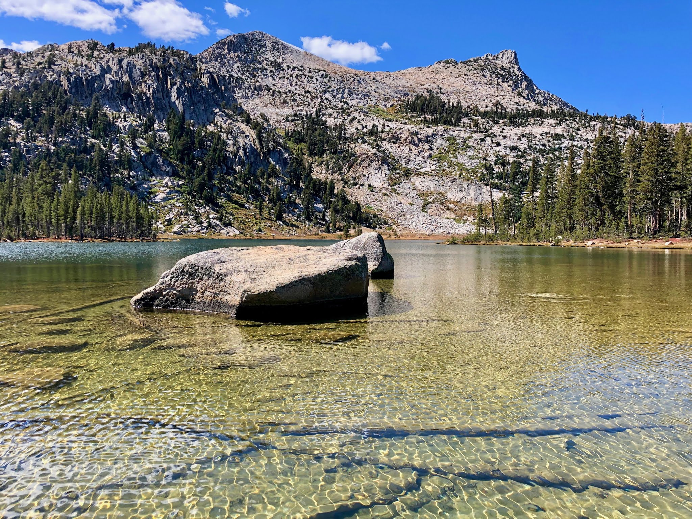
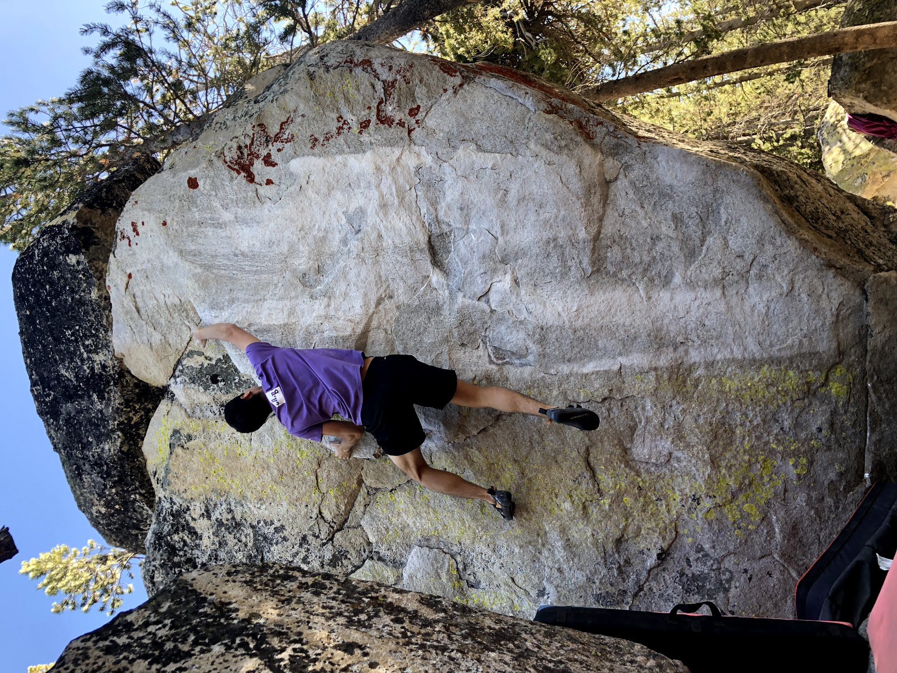
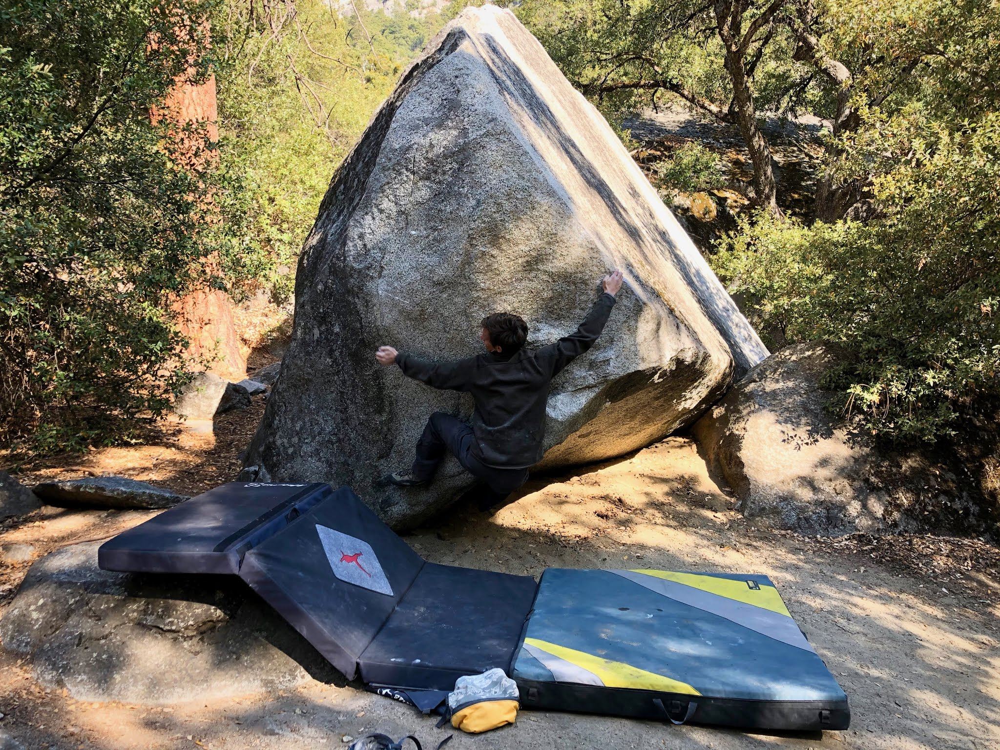

Over the last few weeks I've had the privilege of spending two weekends in Yosemite National Park with great company. The first weekend was in Tuolumme Meadows, right before the seasonal closure of the campgrounds. The next weekend brought me to the Valley. While neither of these trips were strictly for climbing, I still managed to sneak some in! Here's a few pictures...

See you guys out there!

\- Eden
